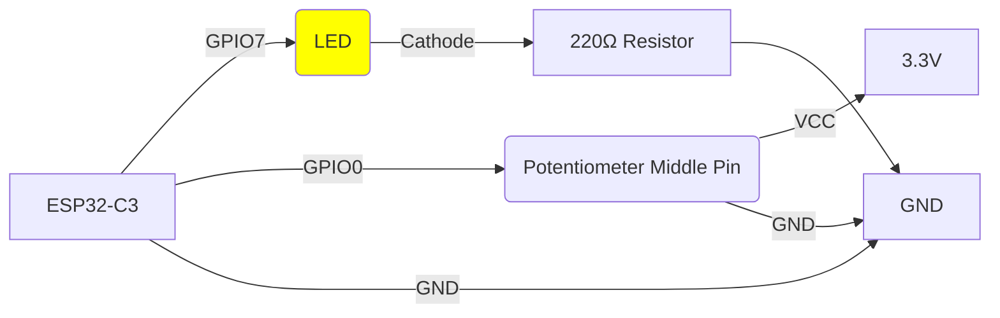

# ESP32-C3 LED Dimmer with Potentiometer

This project controls the brightness of an LED using a potentiometer with an ESP32-C3 microcontroller.


## Project Overview

The ESP32-C3 reads analog values from a potentiometer and uses them to control the brightness of an LED through PWM (Pulse Width Modulation). The LED brightness changes in real-time as you adjust the potentiometer.

## Hardware Connections

The following diagram shows how to connect the components to the ESP32-C3:



### Components Required

- 1x ESP32-C3 development board
- 1x LED (any color)
- 1x Potentiometer (10kΩ recommended)
- 1x 220Ω Resistor (for LED current limiting)
- Breadboard and jumper wires

## Software Implementation

The project is written in Rust using the `esp-hal` crate. The main loop:
1. Reads the ADC value from the potentiometer (0-4095)
2. Maps the value to a PWM duty cycle (0-31 for 5-bit resolution)
3. Sets the LED brightness using PWM
4. Repeats every 50ms for smooth control

### Code Structure

- `src/bin/main.rs`: Contains the main application logic
- `Cargo.toml`: Project dependencies and configuration

## Flashing

To flash this project to your ESP32-C3:

Build the project:
```bash
cargo run --release
```

## Control Characteristics

| Parameter | Value | Description |
|-----------|-------|-------------|
| ADC Range | 0-4095 | 12-bit resolution |
| PWM Resolution | 5-bit (0-31) | LED brightness levels |
| Update Rate | 50ms | Refresh interval |
| PWM Frequency | 12kHz | LED control frequency |

## License

This project is licensed under the MIT License - see the LICENSE file for details.
