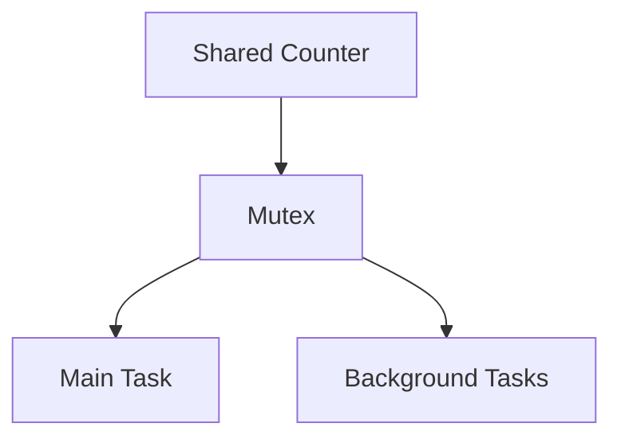
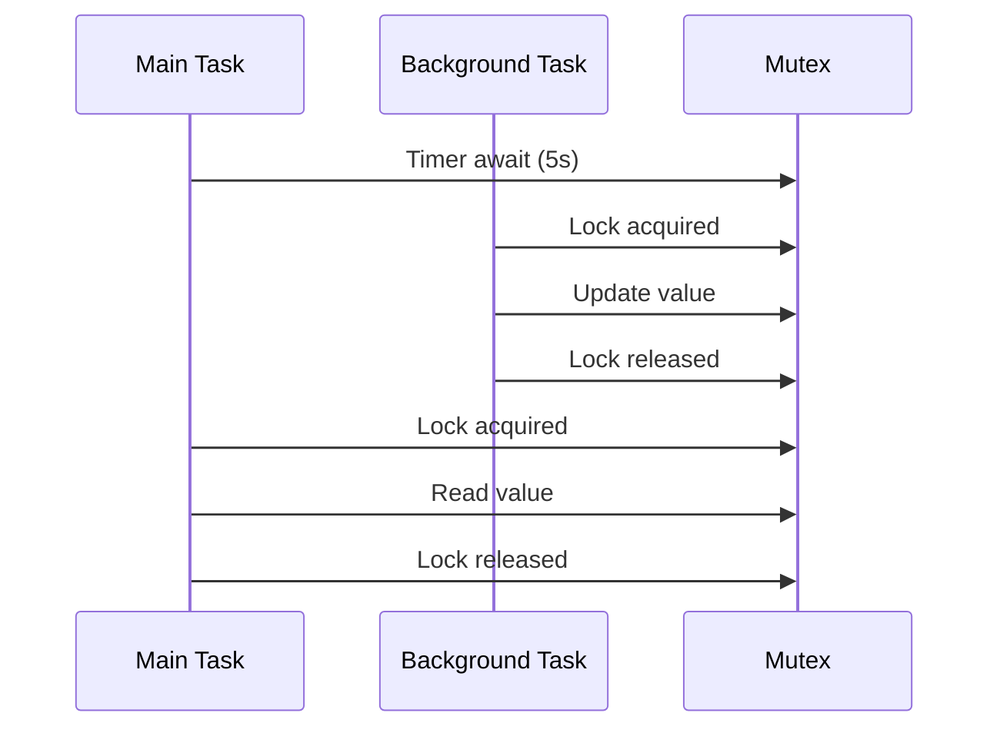
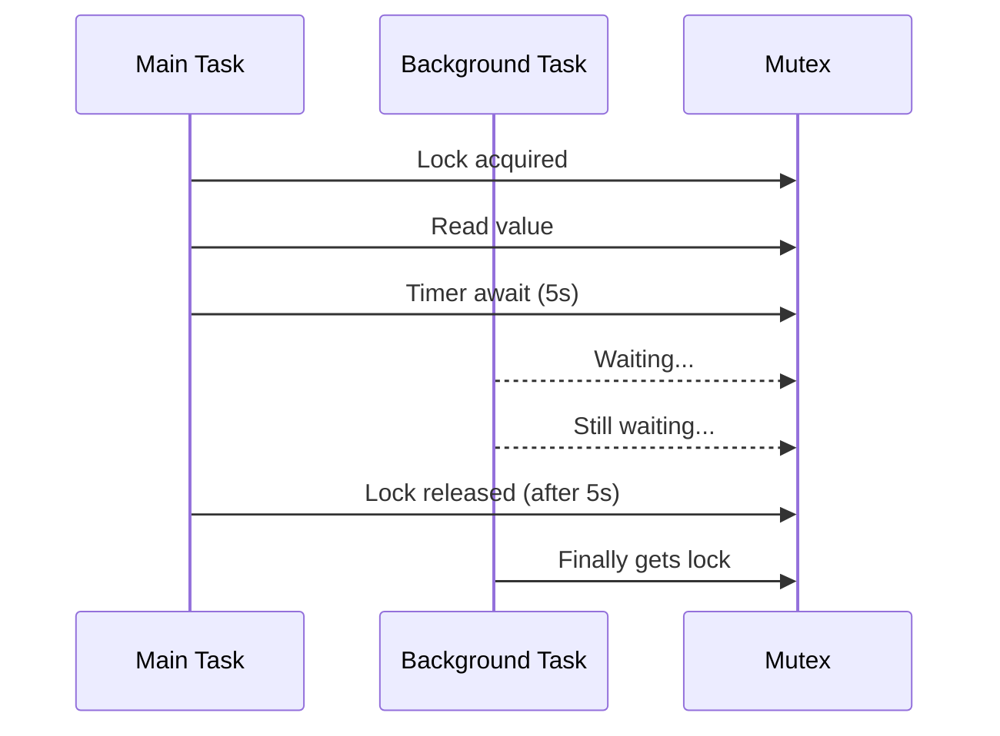
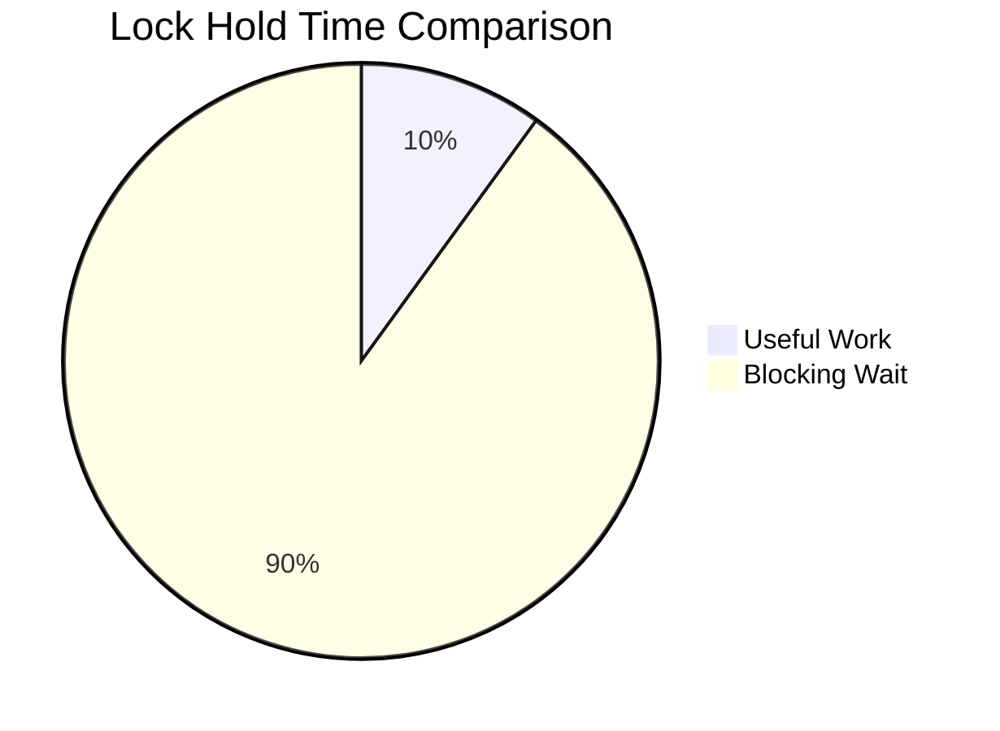

# Async Mutex Patterns: Understanding Lock Ordering in Embassy

This project demonstrates a critical async programming concept through an ESP32 example using Embassy's async mutex. The key lesson focuses on **how await point ordering affects concurrency** when working with shared resources.

## The Classroom Analogy
Imagine our program as a classroom with:
- 🎤 **One Microphone (Mutex)**: Only one speaker at a time
- 👨🏫 **Main Task**: Teacher who periodically checks progress
- 👩🎓👨🎓 **Background Tasks**: Students wanting to update the whiteboard



## Key Code Comparison

### Version 1: Good Practice (Timer First)
```rust
loop {
    Timer::after_millis(5000).await;   // Wait without blocking
    let shared = SHARED.lock().await;  // Quick lock
    println!("MAIN: {shared}");
}
```

### Version 2: Problematic (Lock First)
```rust
loop {
    let shared = SHARED.lock().await;  // Lock acquired
    println!("MAIN: {shared}");
    Timer::after_millis(5000).await;   // Wait WHILE blocking others
}
```

## Mermaid Sequence Diagrams

### Correct Flow: Timer Before Lock


### Blocking Flow: Lock Before Timer


## Critical Concept Explained

### The Pizza Shop Principle 🍕
1. **Good Practice** (Timer first):
   - Wait in line (timer await)
   - Quickly check menu (lock)
   - Step aside immediately

2. **Bad Practice** (Lock first):
   - Stand at menu board (lock)
   - Decide while blocking others (await)
   - Cause pizza line backlog!

### Technical Explanation
- 🔒 **Mutex Guards Persist Through Awaits**: Locks aren't automatically released at await points
- ⏳ **Long Holds Block Progress**: Other tasks queue behind locked resources
- 🔁 **Executor Scheduling**: Tasks only switch at await points

## Best Practices
1. **Minimize Lock Duration**: 
   ```rust
   // DO THIS
   let result = {
       let lock = data.lock().await;
       lock.process()
   }; // Lock released here
   Timer::after(Duration::from_secs(1)).await;
   ```

2. **Avoid Locking Across Awaits**:
   ```rust
   // NOT THIS
   let lock = data.lock().await;
   Timer::after(Duration::from_secs(1)).await;
   use(&lock); // Still holding lock!
   ```

3. **Use Atomic Operations** where possible

## Running the Example
```bash
# Setup ESP toolchain
rustup target add riscv32imc-unknown-none-elf

# Build and flash
cargo build
esptool.py flash target/.../release/main.bin
```

Monitor serial output to see the different behaviors:
```
# Good output
THREAD: 1
THREAD: 2
...
MAIN: 5

# Blocked output
MAIN: 0
MAIN: 0
MAIN: 0
```

## Visual Summary


> "The art of async programming is learning to wait politely" - Embassy Proverbs 3:5
