# Async Programming in Embedded Systems with Embassy

This project demonstrates how async/await and concurrency work in embedded systems using the Embassy framework. We'll use analogies and visualizations to make these concepts easy to understand.

## 🧠 Core Concepts Explained

### 1. Async/Await: The "Meeting Break" Analogy
Imagine you're in a meeting (the microcontroller). When a task needs to wait (like for a timer or I/O operation), it's like a speaker saying:  
"I need to wait for some information - others can speak while I'm waiting."


### 2. Concurrency: The Conference Room
The Embassy executor is like a meeting coordinator managing multiple speakers (tasks). Only one speaker has the floor at a time, but the coordinator efficiently switches between them.


### 3. Mutex: The Shared Whiteboard
When multiple tasks need to access shared data (like a counter), we use a Mutex (Mutual Exclusion). This is like a conference room whiteboard that only one person can write on at a time.

```mermaid
stateDiagram-v2
    [*] --> Task1
    Task1 --> Mutex: Request access
    Mutex --> Task1: Granted ✓
    Task1 --> Mutex: Release
    Mutex --> Task2: Granted ✓
    Task2 --> Mutex: Release
```



## 🔍 Code Walkthrough: Shared Counter Example

Our [`src/bin/main.rs`](src/bin/main.rs) implements these concepts:

### 1. Shared State Setup
```rust
static SHARED: Mutex<CriticalSectionRawMutex, RefCell<u32>> = 
    Mutex::new(RefCell::new(0));
```
- Like reserving a shared whiteboard in the conference room

### 2. Async Task (Background Counter)
```rust
async fn async_task() {
    loop {
        SHARED.lock(|f| { /* update counter */ });
        Timer::after(Duration::from_millis(1000)).await;
    }
}
```
- Takes the "whiteboard" every second to update the count
- `await` yields control while waiting

### 3. Main Task (Periodic Check)
```rust
async fn main(spawner: Spawner) {
    spawner.spawn(async_task()).unwrap();
    loop {
        Timer::after_millis(5000).await;
        let shared = SHARED.lock(|f| { /* read counter */ });
    }
}
```
- Spawns the background task
- Checks the counter every 5 seconds

## 💡 Key Takeaways

1. **Async != Parallel**: Tasks take turns efficiently (concurrency) but don't run simultaneously
2. **Await is Cooperative**: Tasks voluntarily yield control when waiting
3. **Mutex Protects Shared State**: Ensures safe access to shared resources
4. **No OS Needed**: Embassy provides lightweight async runtime for bare-metal systems

## ▶️ Running the Example
```bash
cargo run --release
```

Watch the serial output to see the counter values from both tasks!

## 📚 Further Learning
- [Embassy Documentation](https://embassy.dev/)
- [The Rust Async Book](https://rust-lang.github.io/async-book/)
- [ESP-RS Hardware Abstraction Layer](https://github.com/esp-rs/esp-hal)
