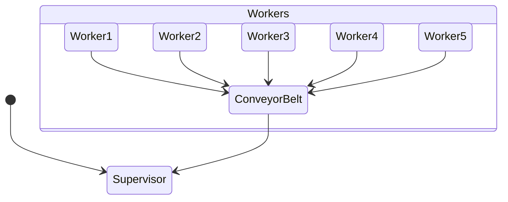
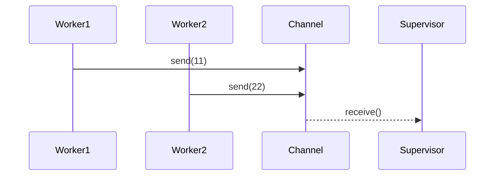

# Embassy Async Channel Demo - Factory Analogy

This project demonstrates async Rust programming using Embassy on ESP32-C3, featuring channel-based communication between multiple tasks. The factory analogy helps visualize async concepts.

## 🏭 Core Analogy

Imagine a factory with:
- **5 Workers** (async tasks) producing items at different speeds
- **1 Conveyor Belt** (channel) transporting items
- **1 Supervisor** (main loop) collecting finished products



## 🔧 Key Components

### 1. Conveyor Belt (Channel)
```rust
static SHARED: Channel<CriticalSectionRawMutex, u8, 5> = Channel::new();
```
- **Capacity**: 5 items (like physical belt length)
- **Safety**: Mutex-protected (safety rails)
- **Item Type**: u8 (simple numeric products)

### 2. Workers (Async Tasks)


Each worker:
1. Places product on conveyor belt (`SHARED.send().await`)
2. Takes timed break (`Timer::after_millis().await`)

### 3. Supervisor (Main Loop)
```rust
loop {
    let data = SHARED.receive().await;
    println!("DATA: {data}");
}
```
- Non-blocking item collection
- Processes items in arrival order
- Never interrupts workers

## 🚀 Running the Factory

1. Connect ESP32-C3 dev board
2. Build and flash firmware:
```bash
cargo run --release
```


## 📚 Learning Points

1. **Async ≠ Multithreading**  
   Workers share single CPU but never block each other

2. **.await ≠ Blocking**  
   Like workers pausing without stopping the assembly line

3. **Channel Synchronization**  
   Automatic backpressure when belt is full (workers wait)

4. **Task Independence**  
   Workers maintain separate states and schedules

## 🛠️ Technical Stack
- Embassy async runtime
- ESP32-C3 RISC-V processor
- Rust `#![no_std]` environment
- Critical section synchronization

## 🌟 Project Structure
```
embassy-channel/
├── src/
│   └── bin/
│       └── main.rs  # Factory control logic
├── Cargo.toml
└── README.md        # This file
