# ESP32-C3 LED Controller with Async Button Handling

 *Example LED pattern (Knight Rider style)*

## 🎯 Project Overview
This project demonstrates asynchronous programming on ESP32-C3 microcontrollers using Embassy-rs. It features:
- Knight Rider-style LED animation with adjustable speed
- Button-controlled speed adjustment with hardware debouncing
- Concurrent task execution (LED control + button monitoring)
- Atomic variable sharing between tasks


## 🧠 Key Concepts Explained

### 1. Async Programming Model


Think of the async executor as a traffic controller:
- The LED task is like a continuous parade float moving back and forth
- The button task is like a speed control station that occasionally adjusts the parade's speed
- Both operate independently but share speed information through a radio (atomic variable)

### 2. Button Debouncing
Mechanical switches create multiple rapid transitions when pressed (like a basketball bouncing). Our debouncing:
1. Detects initial press
2. Waits 50ms for "bounces" to settle
3. Only then registers the press


### 3. LED Animation Pattern
Our "Knight Rider" pattern works like a scanner:

```mermaid
journey
    section LED Animation
      Forward: 5: LED1 → LED2 → LED3 → LED4 → LED5
      Backward: 4: LED5 → LED4 → LED3 → LED2 → LED1
      Repeat: 3: Continuous loop
```


## 🛠 Hardware Setup
| Component | GPIO Pin | Purpose |
|-----------|----------|---------|
| LED 1     | GPIO1    | First LED in sequence |
| LED 2     | GPIO2    | Second LED |
| LED 3     | GPIO3    | Middle LED |
| LED 4     | GPIO4    | Fourth LED |
| LED 5     | GPIO5    | Last LED |
| Button    | GPIO0    | Speed control button |

## 📚 Code Walkthrough

### Key Components:
```rust
static BLINK_DELAY: AtomicU32 = AtomicU32::new(500); // Shared delay variable
static BUTTON: Mutex<...> = Mutex::new(None); // Thread-safe button handle
```

### Button Task Breakdown:


### LED Animation Logic:
```rust
// Forward pass
for led in &mut leds {
    led.set_high();
    Timer::after_millis(delay).await;
    led.set_low();
    Timer::after_millis(50).await;
}

// Backward pass
for led in leds.iter_mut().rev() {
    // Same pattern in reverse
}
```

## ⚙️ How to Use
1. Connect LEDs to GPIO1-5 with appropriate resistors
2. Connect button between GPIO0 and GND
3. Build and flash with cargo:
```bash
cargo run --release

```
4. Press button to control animation speed:
- Each press decreases delay by 50ms
- At 50ms minimum, resets to 500ms

## 📚 Learning Resources
- [Embassy Async Runtime](https://embassy.dev/)
- [ESP-HAL Documentation](https://esp-rs.github.io/esp-hal/)
- [Hardware Debouncing Techniques](https://www.allaboutcircuits.com/technical-articles/switch-bounce-how-to-deal-with-it/)
