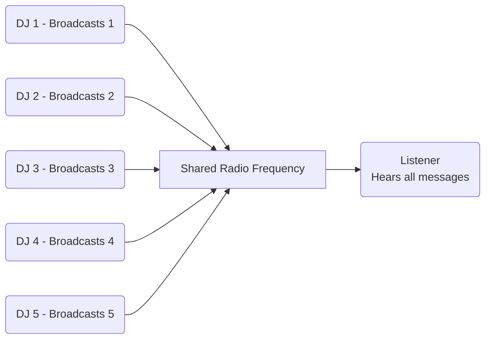

# Embassy Pub-Sub Channel Example - The Radio Station Model 🎙️📻

This project demonstrates asynchronous programming using Embassy's Pub-Sub channel with a **radio station analogy** to help students understand concurrent communication patterns.

## 🎧 How It Works - The Radio Analogy

Imagine our system as a radio station with:
- **5 DJs (Publishers)** - Each broadcasting their own number on a shared frequency
- **1 Listener (Subscriber)** - Tuned to the station hearing all broadcasts
- **Shared Frequency (PubSubChannel)** - The medium carrying all messages



## 📡 Key Components Explained

### 1. The Radio Frequency (PubSub Channel)
```rust
// Like a radio frequency that can carry multiple broadcasts
static SHARED: PubSubChannel<CriticalSectionRawMutex, u8, 5, 1, 5> = PubSubChannel::new();
```
- **5 publishers**: 5 DJs can broadcast simultaneously
- **1 subscriber**: 1 listener tuned to the frequency
- **5 message history**: Like a radio buffer storing recent broadcasts

### 2. The DJs (Publisher Tasks)
Each DJ task:
1. Gets broadcast equipment (`publisher()`)
2. Transmits their number at regular intervals
3. Takes breaks between broadcasts (`Timer::after_millis()`)

```rust
#[embassy_executor::task]
async fn async_task_one() {
    let pub1 = SHARED.publisher().unwrap(); // DJ gets microphone
    loop {
        pub1.publish_immediate(1);          // "Live on air!"
        Timer::after_millis(1000).await;     // Commercial break
    }
}
```

### 3. The Listener (Subscriber)
```rust
let mut sub = SHARED.subscriber().unwrap();
loop {
    let data = sub.next_message_pure().await; // Tuning in...
    println!("DATA: {data} - Heard on the radio!");
}
```
- Constantly listens to the frequency
- Hears any DJ's broadcast immediately
- Prints each received message with radio context

## 📻 Broadcast Schedule
| DJ  | Message | Interval | Analogy                 |
|-----|---------|----------|-------------------------|
| DJ1 | 1       | 1 second | Morning show host       |
| DJ2 | 2       | 2 seconds| Afternoon talk host     |
| DJ3 | 3       | 3 seconds| Evening music host      |
| DJ4 | 4       | 4 seconds| Night news host         |
| DJ5 | 5       | 5 seconds| Overnight replay host   |

## 🚀 Running the Project
1. Connect your ESP32-C3 board
2. Build and flash the firmware:
```bash
cargo build
cargo run
```
3. Watch the serial output to see the radio broadcasts!

## 🎓 Learning Objectives
- Understand pub-sub communication patterns
- Visualize concurrent task execution
- Learn async/await syntax in embedded contexts
- See real-time message passing between tasks
- Grasp timing concepts through DJ schedules

The radio analogy helps visualize how multiple async tasks can safely share resources while maintaining independent timing - just like real radio shows sharing a frequency but broadcasting at different times!
