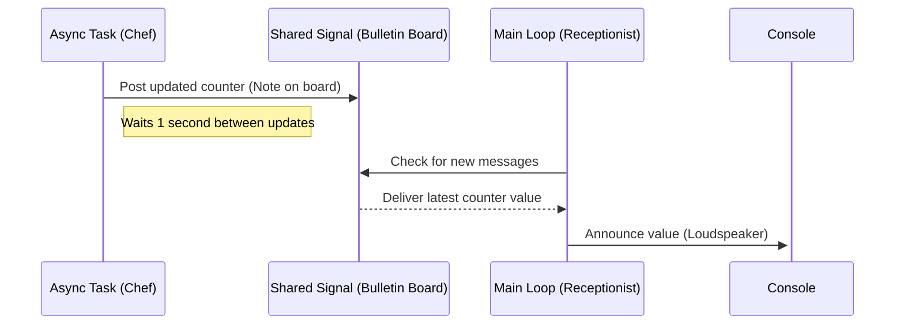
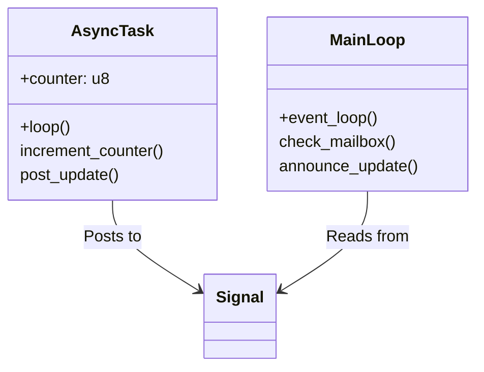

# Async Programming Explained: The Kitchen Timer & Bulletin Board System

This project demonstrates core async/await concepts using Embassy-rs on ESP32. Below we'll explain the concepts using real-world analogies and visual diagrams.



## Key Analogies Explained

### 1. The Async Kitchen (Concurrency Model)
Imagine a kitchen where:
- Each `async` function is a chef with their own timer
- The embassy executor is the head chef coordinating work
- `.await` is setting a kitchen timer while doing other tasks

```rust
async fn async_task() {
    // Chef starts cooking sequence
    Timer::after_millis(1000).await; // Set timer for 1 second
    // Do other work while waiting
}
```

### 2. The Bulletin Board System (Signals)


- Our `SHARED` signal acts like a physical bulletin board
- `signal()` = Pinning a new note to the board
- `wait().await` = Checking the board for updates

### 3. The Receptionist (Main Loop)
The main loop behaves like a hotel receptionist:
1. Waits for new mail (`.await`)
2. Processes received messages
3. Announces important updates (println!)
4. Returns to waiting state

## Key Code Concepts



1. **Non-blocking Waits**  
   `Timer::after_millis(1000).await` works like setting an egg timer - the chef can do other tasks while waiting.

2. **Safe Shared State**  
   Our `Signal` acts like a locked bulletin board preventing:
   - Torn messages (partial reads/writes)
   - Data races (concurrent modifications)

3. **Async Execution**  
   The embassy runtime manages our tasks like a restaurant manager:
   - Wakes tasks when timers expire
   - Ensures fair CPU time allocation
   - Handles task communication

## How to Run
1. Connect ESP32-C3 dev board
2. Build and flash:
```bash
cargo run --release
```


## Learning Resources
- [Embassy Book](https://embassy.dev/book/) - Async fundamentals
- [ESP-HAL Guide](https://esp-rs.github.io/book/) - Hardware specifics
- [Rust Async Book](https://rust-lang.github.io/async-book/) - Core concepts
