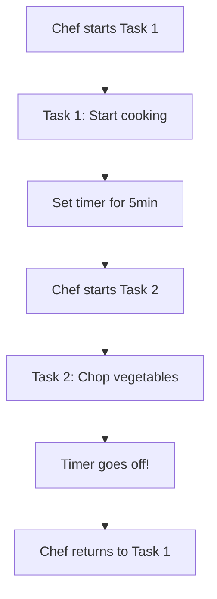
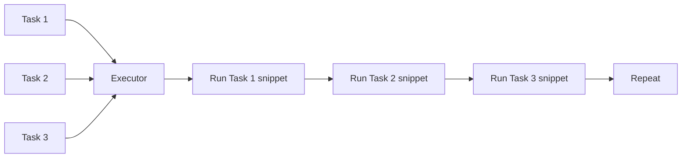
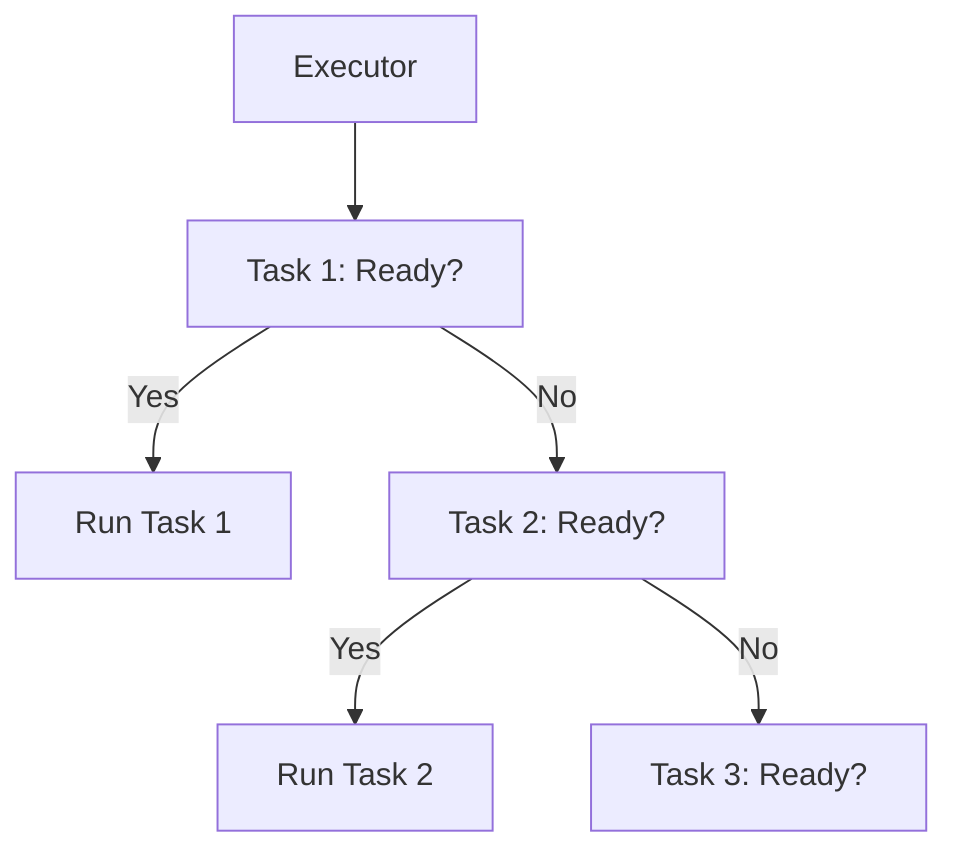
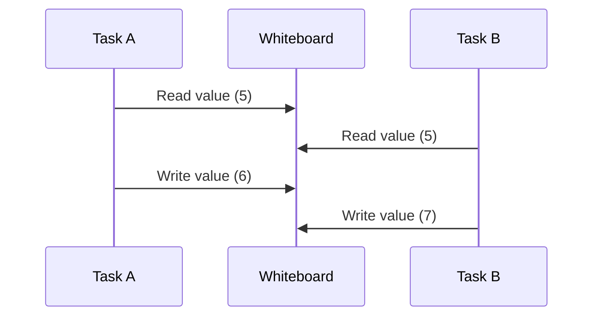

# Async Programming in Embedded Systems with Embassy

This project demonstrates async/await programming in embedded systems using the [Embassy framework](https://github.com/embassy-rs/embassy). It's designed to help students understand key concepts of asynchronous programming and concurrency in resource-constrained environments.

## Core Concepts Explained

### 1. Async/Await: Non-Blocking Operations
Async/await allows your code to pause execution without blocking the CPU. When an async function reaches an `.await` point, it yields control back to the executor, allowing other tasks to run while it waits.

**Analogy**: Think of async tasks like kitchen timers 🕒  
- A chef (CPU) can set multiple timers (async tasks)
- While waiting for a timer to finish, the chef prepares other dishes
- When a timer goes off, the chef returns to that specific task



### 2. Concurrency: Multiple Virtual Threads
Concurrency allows multiple tasks to make progress without true parallel execution. On single-core embedded systems, this is achieved through cooperative multitasking.

**Analogy**: A juggler 🤹  
- The juggler (CPU) handles multiple balls (tasks)
- Each ball gets a moment of attention
- No ball is dropped, but only one is handled at a time



### 3. The Executor: Task Scheduler
The Embassy executor manages async tasks, deciding which one to run based on readiness (similar to how an operating system scheduler works).

**Analogy**: Orchestra conductor 🎼  
- Conductor (executor) coordinates musicians (tasks)
- Signals when each musician should play
- Ensures the performance flows smoothly



### 4. Atomic Operations: Safe Shared State
Atomic operations provide thread-safe access to shared data without locks. They're essential for concurrent programming.

**Analogy**: Shared whiteboard 📋  
- Multiple people (tasks) can read/write safely
- Only one person writes at a time
- Updates are immediately visible to everyone



## Code Walkthrough

Our application demonstrates these concepts with a simple atomic counter:

```rust
static SHARED: AtomicU32 = AtomicU32::new(0);

#[embassy_executor::task]
async fn async_task() {
    loop {
        let val = SHARED.load(Ordering::Relaxed);
        SHARED.store(val + 1, Ordering::Relaxed);
        Timer::after(Duration::from_millis(1000)).await;
    }
}
```

### How It Works
1. **Main Task**: Spawns `async_task` and enters loop
2. **Async Task**: Increments shared counter every second
3. **Concurrent Access**: Both tasks safely access `SHARED` atomic variable
4. **Non-blocking**: `.await` allows CPU to handle other tasks during delays

## Running the Example

1. Connect ESP32-C3 development board
2. Build and flash the firmware:
```bash
cargo run --release
```


You'll see the counter incrementing every second in the serial monitor.

## Key Takeaways

1. **Async != Parallel**: Async enables concurrency on single-core systems
2. **Cooperative Multitasking**: Tasks must yield control voluntarily
3. **Zero-Cost Abstraction**: Embassy has minimal runtime overhead
4. **Safe Concurrency**: Atomics prevent data races without locks
5. **Efficient Resource Use**: Perfect for memory-constrained devices

## Further Learning

1. [Embassy Documentation](https://embassy.dev/)
2. [The Async Book](https://rust-lang.github.io/async-book/)
3. [Rust Atomics and Locks](https://marabos.nl/atomics/)
