# ESP32-C3 Fading Lights

This project implements a fading LED sequence using an ESP32-C3 microcontroller with three LEDs (red, yellow, and green) connected via the LEDC (LED Controller) peripheral for smooth fading.


https://github.com/user-attachments/assets/b0d40728-40db-48ec-a414-cad42a496808


## Project Overview

The ESP32-C3 controls three LEDs in a fading sequence:
1. Red LED fades in over 2 seconds (from 0% to 100% brightness)
2. Yellow LED fades in over 2 seconds
3. Green LED fades in over 2 seconds
4. All LEDs fade out in sequence over 0.5 seconds each
5. The device enters light sleep mode for 10 seconds between cycles

The cycle then repeats indefinitely.

## Hardware Connections

The following diagram shows how to connect the LEDs to the ESP32-C3 using the LEDC peripheral:

```mermaid
graph LR
    A[ESP32-C3] -->|GPIO1| B(Red LED)
    B --> R1[220Ω]
    R1 --> E[GND]
    
    A -->|GPIO2| C(Yellow LED)
    C --> R2[220Ω]
    R2 --> E
    
    A -->|GPIO3| D(Green LED)
    D --> R3[220Ω]
    R3 --> E
    
    A -->|GND| E
    style B fill:#ff0000
    style C fill:#ffff00
    style D fill:#00ff00
```



### Components Required
- 1x ESP32-C3 development board
- 3x LEDs (Red, Yellow, Green)
- 3x 220Ω resistors
- Breadboard and jumper wires

## Software Implementation
The project is written in Rust using the `esp-hal` crate. The LEDC peripheral controls the fading sequence:
1. Configure LEDC timer with 12kHz frequency and 5-bit resolution
2. Set up three PWM channels (one for each LED)
3. Sequentially fade each LED in and out in a loop

### Code Structure
- `src/bin/main.rs`: Contains the main application logic
- `Cargo.toml`: Project dependencies and configuration

## Flashing
To flash this project to your ESP32-C3:

Build the project:
```bash
cargo run --release
```

## Fading Sequence
| LED    | Fade Direction | Duration |
|--------|----------------|----------|
| Red    | In             | 2 seconds |
| Yellow | In             | 2 seconds |
| Green  | In             | 2 seconds |
| Red    | Out            | 0.5 seconds |
| Yellow | Out            | 0.5 seconds |
| Green  | Out            | 0.5 seconds |
| Sleep  | Light Sleep    | 10 seconds |
| **Total Cycle** | | **17.5 seconds** |

## License
This project is licensed under the MIT License - see the LICENSE file for details.
