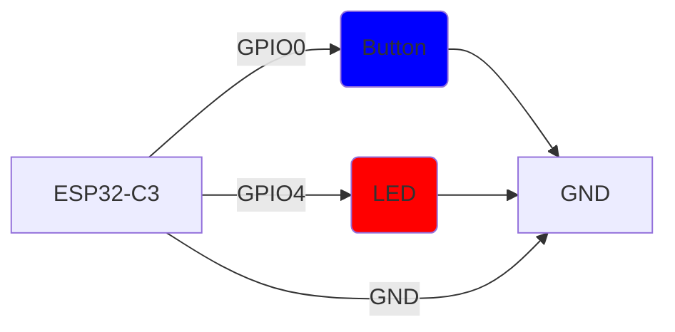

# ESP32-C3 Interrupt Button

A Rust implementation of a button interrupt system using an ESP32-C3 microcontroller that toggles an LED and tracks press count.

## Project Description

This project demonstrates GPIO interrupt handling with the ESP32-C3 microcontroller:
- Toggles LED on GPIO4 when button on GPIO0 is pressed
- Tracks and prints button press count via UART
- Uses critical sections for safe peripheral access

## Hardware Configuration

### Connection Diagram



### Required Components

- ESP32-C3 development board
- 1x LED (connected to GPIO4)
- 1x Push button (connected to GPIO0 with internal pull-up)
- Breadboard and jumper wires

## Software Architecture

- **Framework**: Rust with `esp-hal` crate
- **Main Logic**: `src/bin/main.rs`
- **Concurrency**: Uses `critical-section` and `Mutex` for safe interrupt handling
- **Features**: 
  - Button debouncing with 500ms delay
  - Falling edge interrupt detection
  - LED toggle using hardware-optimized method
  - UART logging via `defmt` and `esp-println`

## Build & Deployment

To flash the project:
```bash
cargo run --release
```

## Functionality

1. LED starts in OFF state
2. Each validated button press (with 50ms debounce):
   - Toggles LED state using hardware-optimized toggle()
   - Increments and prints press count
   - Ignores mechanical bounce artifacts
3. Uses 5mA drive strength for LED output

## License

MIT License - see [LICENSE](LICENSE) file for details.
