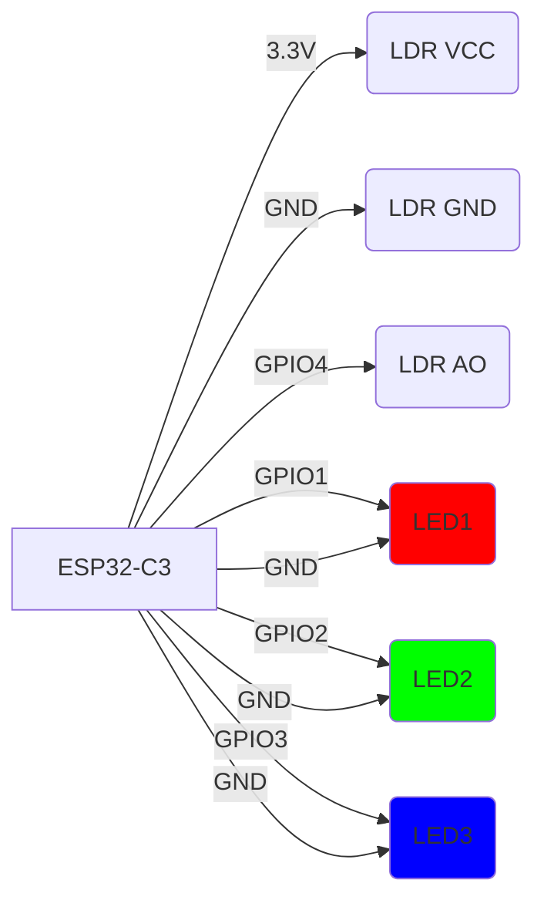

# ESP32-C3 Light Sensor LED Controller

This project uses an ESP32-C3 microcontroller to read light levels from an LDR sensor and control LEDs based on the measured brightness.


https://github.com/user-attachments/assets/f5a00a0d-c88c-46e9-ba52-03a3ef3083a9


## Project Overview

The ESP32-C3 reads analog values from an LDR sensor and controls three LEDs:
- When light levels are low (below 1000), all LEDs are OFF
- At medium-low light (1000-2000), only LED1 turns ON
- At medium light (2000-3000), LED1 and LED2 turn ON
- At high light (above 3000), all three LEDs turn ON

The system continuously monitors light levels and updates the LED status accordingly.

## Hardware Connections

The following diagram shows how to connect the LDR sensor and LEDs to the ESP32-C3:



### Components Required

- 1x ESP32-C3 development board
- 1x LDR sensor module (with AO, DO, GND, VCC pins)
- 3x LEDs (any colors)
- Breadboard and jumper wires

Resistors are not needed for the LEDs because we set 5mA as a current cap on each pin, which is safe for LEDs that typically operate between 20-35mA.

## Software Implementation

The project is written in Rust using the `esp-hal` crate. The main loop:
1. Reads the analog value from GPIO4 (LDR AO pin)
2. Compares the reading against predefined thresholds
3. Controls the LEDs based on the light level
4. Prints the current reading to serial for monitoring
5. Waits 1 second before repeating

### Code Structure

- `src/bin/main.rs`: Contains the main application logic
- `Cargo.toml`: Project dependencies and configuration

## Flashing

To flash this project to your ESP32-C3:

1. Build the project:
   ```bash
   cargo build --release
   ```

2. Flash the firmware (using appropriate flashing tool for your setup)

## Light Level Behavior

| Light Level | ADC Reading | LED Status |
|-------------|-------------|------------|
| Very Dark   | < 1000      | All OFF    |
| Dim         | 1000-2000   | LED1 ON    |
| Medium      | 2000-3000   | LED1+2 ON  |
| Bright      | > 3000      | All ON     |

## Calibration

After flashing:
1. Open serial monitor to view ADC readings
2. Adjust threshold values in `src/bin/main.rs` based on your environment
3. Reflash with updated thresholds

## License

This project is licensed under the MIT License - see the LICENSE file for details.
