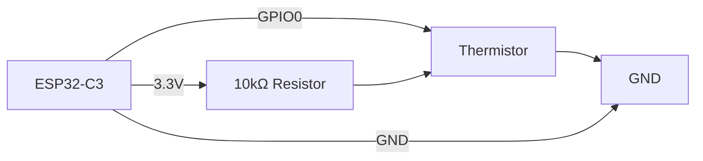

# ESP32-C3 Temperature Monitor with Thermistor

This project implements a temperature monitoring system using an ESP32-C3 microcontroller and a thermistor (NTC) to measure ambient temperature.

## Project Overview

The ESP32-C3 reads the analog value from a thermistor connected to GPIO0 and converts it to a temperature reading using the B-parameter equation. The temperature is displayed in the serial monitor every second.

## Hardware Connections

The following diagram shows how to connect the thermistor to the ESP32-C3:



### Components Required

- 1x ESP32-C3 development board
- 1x NTC Thermistor (10kΩ at 25°C)
- 1x 10kΩ Resistor (for voltage divider)
- Breadboard and jumper wires

## Software Implementation

The project is written in Rust using the `esp-hal` crate. The main loop performs the following operations:

1. Read ADC value from the thermistor
2. Convert ADC value to resistance using the voltage divider formula
3. Calculate temperature using the B-parameter equation
4. Display temperature in Celsius on the serial monitor
5. Wait 1 second before repeating

### Code Structure

- `src/bin/main.rs`: Contains the main application logic
- `Cargo.toml`: Project dependencies and configuration

## Flashing

To flash this project to your ESP32-C3:

Build and run the project:
   ```bash
   cargo run --release
   ```

## Temperature Calculation

The project uses the B-parameter equation to convert resistance to temperature:

```
1/T = 1/T₀ + (1/B) * ln(R/R₀)
```

Where:
- T is the temperature in Kelvin
- T₀ is the reference temperature (25°C = 298.15K)
- B is the B-value of the thermistor (3950)
- R is the current resistance
- R₀ is the reference resistance (10kΩ at 25°C)

## License

This project is licensed under the MIT License - see the LICENSE file for details.
