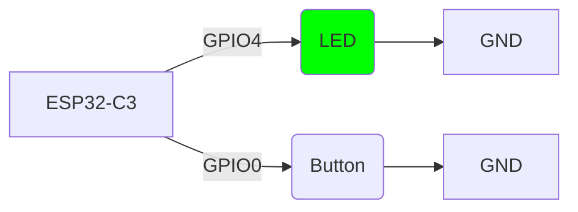

# ESP32-C3 Rate-Controlled LED Blink

This project implements a variable rate LED blinking system using an ESP32-C3 microcontroller. The blinking rate can be adjusted by pressing a button connected to the board.


https://github.com/user-attachments/assets/dba7d362-6077-4355-b2e3-44c3ec1e8546


## Project Overview

The ESP32-C3 controls an LED with a variable blinking rate that can be adjusted by pressing a button:
- Default blink rate: 1 second ON, 1 second OFF
- Each button press decreases the blink delay by 25ms
- Minimum delay: 25ms (40Hz)
- When delay reaches minimum, it resets to default (1 second)

## Hardware Connections

The following diagram shows how to connect the button to the ESP32-C3:



### Components Required

- 1x ESP32-C3 development board
- 1x LED
- 1x Button
- Resistors are not needed, because we set 5mA as a current cap on each pin
    that's safe current for LEDs, that can operate safely between 20-35mA.
- Breadboard and jumper wires

## Software Implementation

The project is written in Rust using the `esp-hal` crate. The main loop controls the LED with a variable delay that can be adjusted by pressing the button:

1. LED starts with 1 second ON/OFF cycle
2. When button is pressed, delay decreases by 25ms
3. Minimum delay is 25ms (40Hz)
4. When delay reaches minimum, it resets to 1 second
5. Process repeats indefinitely

### Code Structure

- `src/bin/main.rs`: Contains the main application logic
- `Cargo.toml`: Project dependencies and configuration

## Building and Flashing

To flash this project to your ESP32-C3:
Build the project:
   ```bash
   cargo run --release
   ```

## Rate Control Sequence

| Action | Delay |
|--------|-------|
| Default rate | 1,000,000 μs (1 second) |
| Button press effect | Decrease by 25,000 μs (25ms) |
| Minimum delay | 25,000 μs (25ms) |
| Reset condition | When delay < 25,000 μs |

## License

This project is licensed under the MIT License - see the LICENSE file for details.
