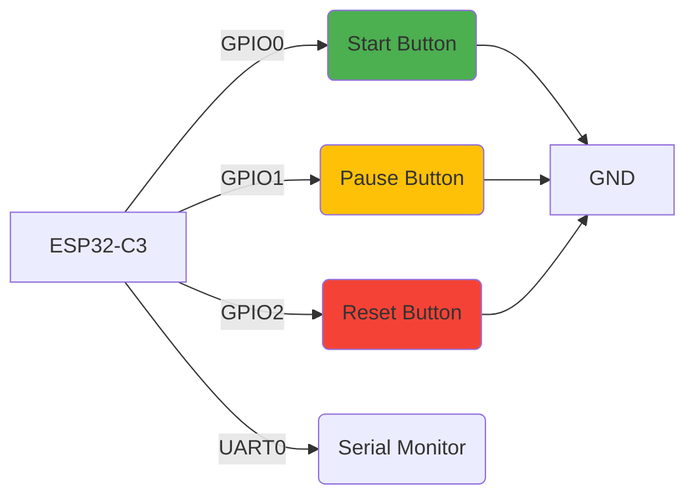

# ESP32-C3 Real-Time Timer with Start/Pause/Reset Controls

This project implements a real-time timer with start, pause, and reset functionality using an ESP32-C3 microcontroller. The timer displays elapsed time in HH:MM:SS format over serial and features software debouncing for reliable button operation.

## Project Overview

The ESP32-C3 implements a timer that:
- Displays elapsed time in HH:MM:SS format over serial
- Provides start, pause, and reset functionality via buttons
- Uses hardware timer interrupts for precise timing
- Implements software debouncing for reliable button presses
- Features automatic rollover at 24 hours

## Hardware Connections



### Components Required
- ESP32-C3 development board
- 3x tactile buttons
- Breadboard and jumper wires
- USB cable for programming and serial monitoring

Note: Internal pull-up resistors are used, so external resistors are not required.

## Software Implementation
The project is written in Rust using the `esp-hal` crate. Key features include:
- Hardware timer configured for 1-second interrupts
- Critical sections for safe shared resource access
- Button debouncing logic to prevent multiple triggers
- Time tracking with automatic rollover at 24 hours

### Button Functions
| Button | GPIO | Function |
|--------|------|----------|
| Start  | GPIO0 | Starts/resumes timer |
| Pause  | GPIO1 | Pauses timer |
| Reset  | GPIO2 | Resets timer to 00:00:00 |

## Flashing Instructions
To flash this project to your ESP32-C3:

1. Connect the ESP32-C3 via USB
2. Build and flash the project:
```bash
cargo run --release
```

## Code Structure
- `src/bin/main.rs`: Main application logic
- `Cargo.toml`: Project dependencies and configuration

## License
This project is licensed under the MIT License - see the LICENSE file for details.
