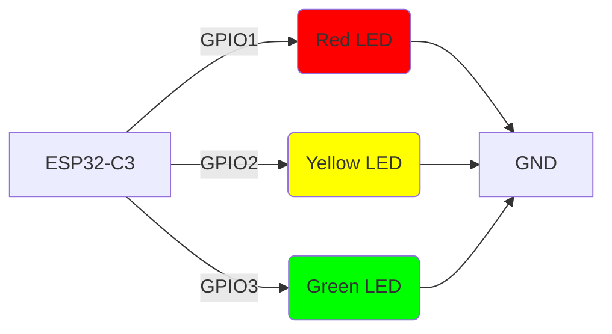
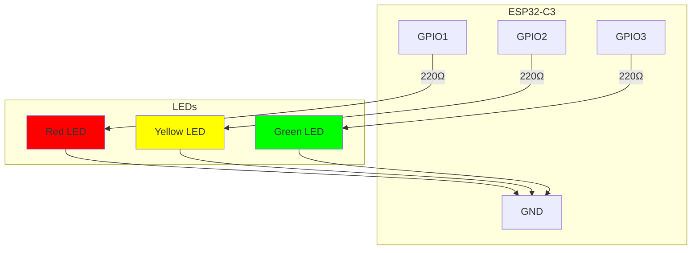

# ESP32-C3 Blinking Lights Semaphore

This project implements a semaphore traffic light system using an ESP32-C3 microcontroller with three LEDs (red, yellow, and green).

## Project Overview

The ESP32-C3 controls three LEDs in a sequence that simulates a traffic light:
- Red LED: 10 seconds ON
- Green LED: 7 seconds ON
- Yellow LED: 3 seconds ON

The cycle then repeats indefinitely.

## Hardware Connections

The following diagram shows how to connect the LEDs to the ESP32-C3:



### Components Required

- 1x ESP32-C3 development board
- 3x LEDs (Red, Yellow, Green)
- Resistors are not needed, becouse we set 5mA as a current cap on each pin
    thats safe current for leds, that can operate safely between 20-35mA.
- Breadboard and jumper wires

### Schematic Diagram



## Software Implementation

The project is written in Rust using the `esp-hal` crate. The main loop controls the LEDs in the following sequence:

1. Turn on Red LED for 10 seconds
2. Turn off Red LED and turn on Green LED for 7 seconds
3. Turn off Green LED and turn on Yellow LED for 3 seconds
4. Repeat from step 1

### Code Structure

- `src/bin/main.rs`: Contains the main application logic
- `Cargo.toml`: Project dependencies and configuration

## Building and Flashing

To build and flash this project to your ESP32-C3:

1. Install the required tools:
   ```bash
   cargo install espflash
   ```

2. Build the project:
   ```bash
   cargo build
   ```

3. Flash to the ESP32-C3:
   ```bash
   espflash flash --release
   ```

## Timing Sequence

| Light | Duration |
|-------|----------|
| Red   | 10 seconds |
| Green | 7 seconds  |
| Yellow| 3 seconds  |
| **Total Cycle** | **20 seconds** |

## License

This project is licensed under the MIT License - see the LICENSE file for details.
