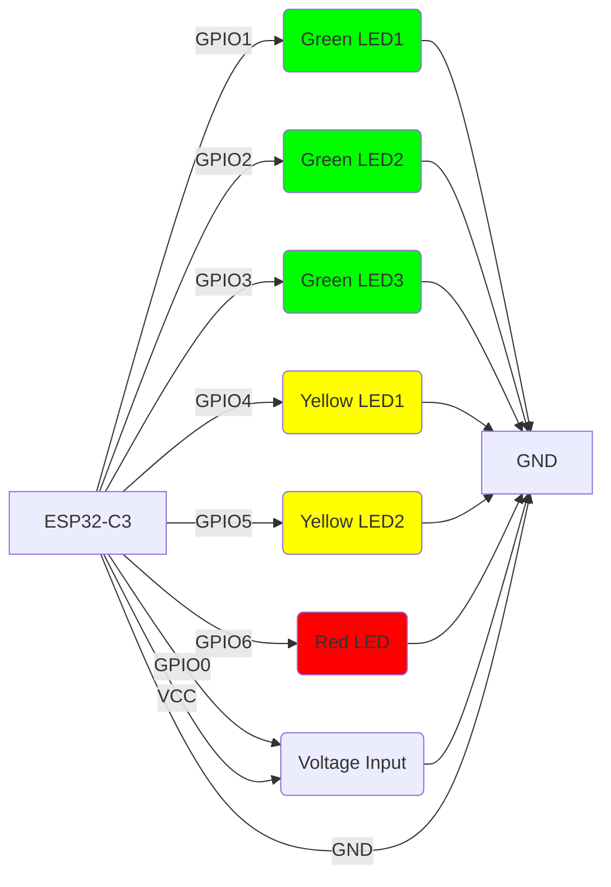

# ESP32-C3 Simple Voltmeter

This project implements a voltage measurement system using an ESP32-C3 microcontroller with progressive LED indicators. It reads analog voltage from GPIO0 and lights up LEDs progressively based on the measured voltage.


https://github.com/user-attachments/assets/050bd6b0-88f3-438b-9645-54e28fcd2cde


## Project Overview

The ESP32-C3 reads analog voltage from GPIO0 and controls six LEDs to indicate the voltage level:
- 3 Green LEDs: Light up at lower voltages
- 2 Yellow LEDs: Light up at medium voltages
- 1 Red LED: Lights up at high voltages

The voltage thresholds are:
- Green1: >500mV
- Green2: >1000mV
- Green3: >1500mV
- Yellow1: >2000mV
- Yellow2: >2500mV
- Red: >3000mV

## Hardware Connections

The following diagram shows how to connect the LEDs to the ESP32-C3:



### Components Required
- 1x ESP32-C3 development board
- 3x Green LEDs
- 2x Yellow LEDs
- 1x Red LED
- Resistors are not needed, as we set 5mA as a current cap on each pin
- Breadboard and jumper wires

## Software Implementation

The project is written in Rust using the `esp-hal` crate. The main loop:
1. Reads voltage from GPIO0 (ADC pin)
2. Converts the raw ADC value to millivolts
3. Lights up LEDs progressively based on voltage thresholds
4. Prints voltage readings to serial console
5. Repeats every 500ms

### Code Structure
- `src/bin/main.rs`: Contains the main application logic
- `Cargo.toml`: Project dependencies and configuration

## Flashing

To flash this project to your ESP32-C3:

Build the project:
```bash
cargo run --release
```

## LED Thresholds

| LED       | Color  | Voltage Threshold | Description          |
|-----------|--------|-------------------|----------------------|
| Green1    | Green  | >500mV            | Low voltage indicator|
| Green2    | Green  | >1000mV           | Medium-low voltage   |
| Green3    | Green  | >1500mV           | Medium voltage       |
| Yellow1   | Yellow | >2000mV           | Medium-high voltage  |
| Yellow2   | Yellow | >2500mV           | High voltage         |
| Red       | Red    | >3000mV           | Maximum voltage      |

## License

This project is licensed under the MIT License - see the LICENSE file for details.
