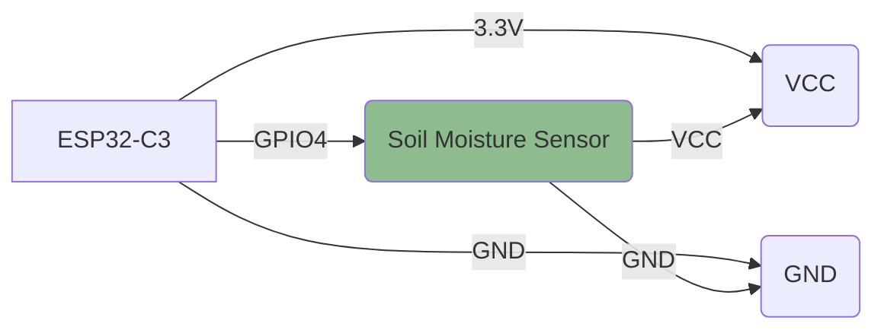

# ESP32-C3 Soil Moisture Measurement

This project implements a soil moisture monitoring system using an ESP32-C3 microcontroller with an analog soil moisture sensor.

## Project Overview

The ESP32-C3 reads soil moisture values from an analog sensor and categorizes them into three states:
- Below 1500: Soil is wet
- 1500 to 3200: Ideal moisture level for plants
- Above 3200: Plant needs water

The system prints the current reading and status to the serial monitor every 2 seconds.

## Hardware Connections

The following diagram shows how to connect the soil moisture sensor to the ESP32-C3:



### Components Required
- 1x ESP32-C3 development board
- 1x Analog soil moisture sensor
- Breadboard and jumper wires
- Micro USB cable for programming and power

## Software Implementation

The project is written in Rust using the `esp-hal` crate. The main loop:
1. Reads the analog value from GPIO4
2. Compares the value against moisture thresholds
3. Prints the appropriate status message
4. Waits 2 seconds before repeating

### Code Structure
- `src/bin/main.rs`: Contains the main application logic
- `Cargo.toml`: Project dependencies and configuration

## Flashing

To flash this project to your ESP32-C3:

Build the project:
```bash
cargo run --release
```

## Moisture Thresholds

| Reading Range | Status | Description |
|---------------|--------|-------------|
| < 1500 | Wet Soil | Soil contains sufficient water |
| 1500 - 3200 | Ideal | Optimal moisture level for plants |
| > 3200 | Dry | Plant needs watering |

## License

This project is licensed under the MIT License - see the LICENSE file for details.
