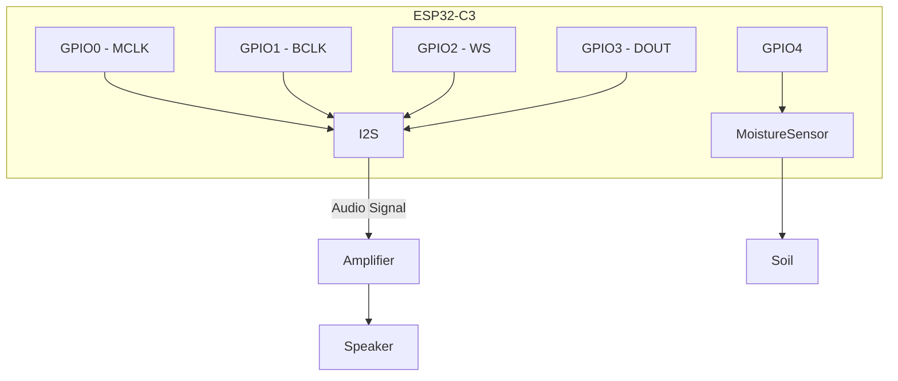
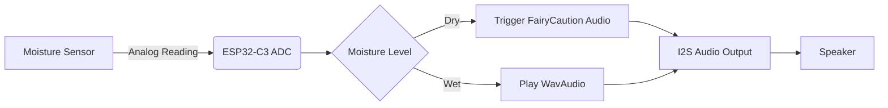
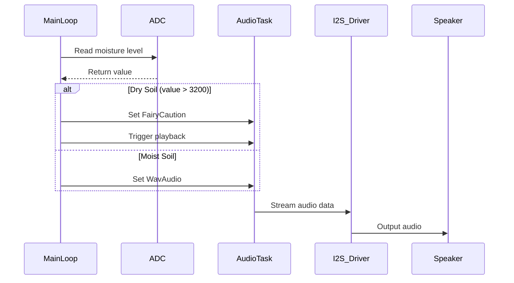

# ESP32-C3 WAV/MP3 Player with Plant Monitoring

## Hardware Wiring Diagram



## Pin Configuration Table

| ESP32-C3 Pin | Connection       | Function               |
|--------------|-----------------|------------------------|
| GPIO0        | I2S Device      | Master Clock (MCLK)    |
| GPIO1        | I2S Device      | Bit Clock (BCLK)       |
| GPIO2        | I2S Device      | Word Select (WS)       |
| GPIO3        | I2S Device      | Data Out (DOUT)        |
| GPIO4        | Moisture Sensor | Analog Input (ADC)     |
| 3V3          | I2S Device      | Power                 |
| 3V3          | Moisture Sensor | Power                 |
| GND          | I2S Device      | Ground                |
| GND          | Moisture Sensor | Ground                |

## System Architecture



## Audio Processing Flow



## Key Features

1. **Audio Playback**:
   - Supports WAV and MP3 formats
   - 16-bit resolution at 11.025 kHz sample rate
   - DMA-based streaming for smooth playback

2. **Plant Monitoring**:
   - Continuous soil moisture monitoring
   - Configurable dry/wet thresholds
   - Audio alerts when plants need water

3. **Power Management**:
   - Efficient CPU usage with async tasks
   - Low-power sleep between measurements

## Getting Started

1. **Hardware Setup**:
   - Connect I2S device to specified GPIO pins
   - Connect moisture sensor to GPIO4
   - Power all components from 3.3V source

2. **Software Installation**:
   ```bash
   cargo build --release
   cargo espflash --monitor
   ```

3. **Audio Files**:
   - Place audio files in `src/audios/`
   - Supported formats: WAV, MP3
   - Update `AudioClip` enum to reference new files

## Troubleshooting

| Symptom               | Solution                          |
|-----------------------|-----------------------------------|
| No audio output       | Check I2S connections and GPIOs   |
| Distorted audio       | Verify sample rate configuration  |
| Inconsistent readings | Calibrate moisture sensor         |
| High CPU usage        | Check DMA buffer size configuration |